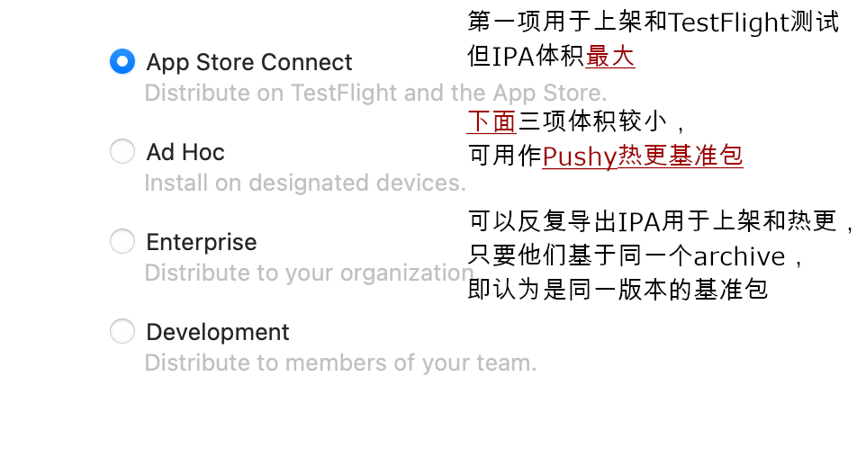
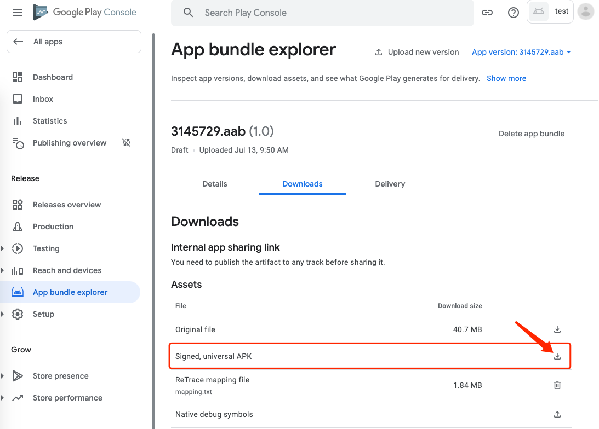

#### 优化原生和热更包体积

##### iOS 原生包优化(ipa)

对于同一份 archive（其版本号、编译时间和内置 bundle 已固定，不会受导出方式所影响），可以用不同选项多次导出 ipa，选择其中最小的上传到 pushy 服务器作为热更基准包。



##### Android 原生包优化(apk)

apk 的优化主要考虑两个方向：

- [启用 proguard 压缩混淆源码](https://reactnative.cn/docs/signed-apk-android#%E5%90%AF%E7%94%A8proguard%E6%9D%A5%E5%87%8F%E5%B0%91apk%E7%9A%84%E5%A4%A7%E5%B0%8F%EF%BC%88%E5%8F%AF%E9%80%89%EF%BC%89)。但这一步可能导致一些使用反射的代码运行时报错，启用后需要充分测试每个页面和功能，以及需要阅读一些第三方关于 proguard 的特别设置说明。
- [分开编译不同的 cpu 架构](https://reactnative.cn/docs/signed-apk-android#%E9%92%88%E5%AF%B9%E4%B8%8D%E5%90%8C%E7%9A%84-cpu-%E6%9E%B6%E6%9E%84%E7%94%9F%E6%88%90-apk-%E4%BB%A5%E5%87%8F%E5%B0%8F-apk-%E6%96%87%E4%BB%B6%E7%9A%84%E5%A4%A7%E5%B0%8F)。找到`android/app/build.gradle`中的 cpu 架构部分，如下所示启用`enable`选项：

```diff
splits {
    abi {
        reset()
-       enable enableSeparateBuildPerCPUArchitecture
+       enable true        // 启用单独的 cpu 架构编译
        universalApk false  // If true, also generate a universal APK
    }
}
```

如此一来会在编译目录中输出多个 apk 文件，分发和上传到热更新服务时只需要使用`app-arm64-v8a-release.apk`文件，可以大幅减小 apk 的大小。

##### 热更新包优化(ppk)

热更新包的主要内容是 js 包和其所引用的静态资源（主要是图片）。

- js 包成分分析。可以借助一些第三方工具（如[react-native-bundle-visualizer](https://github.com/IjzerenHein/react-native-bundle-visualizer)）来分析 js 文件中哪些占比较大，是否可以用其他库替换等（如 dayjs 替换 moment，lodash-es 替换 lodash）。
- 图片优化。
  - 在保证体验的情况下，使用一些工具对图片进行裁剪压缩。
  - 如不需要图片的透明像素，可以考虑将 png 格式转为 jpg 格式。
  - 还可以进一步考虑压缩比更高的图片格式，例如 webp 格式（需要第三方原生插件例如[react-native-webp-format](https://github.com/Aleksefo/react-native-webp-format#readme)），heif 格式（iOS 11 和 Android 10 以上原生支持）等。这里有个图片格式对比可供参考 <https://compare.rokka.io/_compare/#heif=40&jpeg=80&webp=80&av1=40&width=800>。

#### 有很多渠道包需要热更，如何操作比较方便？

1. 如果渠道包的`js代码和初始资源`有差别（无论多么细微的差别都会生成不同的 jsbundle），那么只能单独生成 apk，分别上传和绑定。可以考虑写一些脚本自动调用 cli 来执行批量操作。
2. 如果渠道包的`js代码和初始资源`完全一致，可以考虑使用[Flavor 构建](https://developer.android.com/studio/build/build-variants?hl=zh-cn)，或其他一些动态生成渠道包的方案（比如[腾讯的 VasDolly](https://github.com/Tencent/VasDolly)，[美团的 walle](https://github.com/Meituan-Dianping/walle)等），这样所有的渠道包基于同一个基础 apk 生成（因而会有相同的编译时间戳和 jsbundle）。这样可以只用上传一个基础 apk，对此 apk 的热更操作可以对所有渠道包生效。
3. 如果您是`高级版`、`专业版`或`大客户VIP版`客户，也可以考虑在管理后台的应用设置中启用`忽略编译时间戳`。此选项仅对比版本号，不校验时间戳，可提供更宽容的热更策略，但可能消耗更多流量。

#### 如何支持 aab 格式的原生包？

如果您需要使用 aab 格式的 android 原生包，那么可以在上传到 Google play 之后，在其控制台中下载转换后的 apk 格式（见下图），然后将这个 apk 包上传到热更新的后台，即可正常支持热更新。



#### CI 的集成

在开发环境中，每次 bundle 都会生成一个不同名字的 ppk 文件，这不利于持续集成(CI)系统的引入。

要解决这个问题,你可以使用`--output`参数来指定输出 ppk 文件的名字和路径，便于进行自动发布。

#### 测试、发布与回滚

我们强烈建议您先发布一个**测试包**，再发布一个除了版本号以外均完全相同的**正式包**。

例如，假设我们有一个正式包，版本为`1.6.0`，那么可以修改版本号重新打包一个`1001.6.0`，以一个明显不太正常的版本号来标识它是一个测试版本，同时后几位相同，可以表明它和某个正式版本存在关联（内容/依赖一致）。

在每次往发布包发起热更新之前，先对**测试包**`1001.6.0`进行更新操作，基本测试通过之后，再在网页后台上将热更包重新绑定到**正式包**`1.6.0`上。如果在测试包中发现了重大问题，你就可以先进行修复，更新测试确认通过后再部署到正式线上环境。这样，可以最大程度的避免发生线上事故。

万一确实发生线上事故需要回滚的话，首先利用版本控制系统回滚代码到正常的状态，然后重新生成热更包并推送即可。

#### 元信息(Meta Info)的使用

在发布热更新版本时，或者在网页端，你可以编辑版本的元信息。这是一段在检查更新时可以获得的字符串，你可以在其中按你所想的格式（一般建议用[JSON 格式](https://developer.mozilla.org/zh-CN/docs/Learn/JavaScript/Objects/JSON)）保存一些信息。

比如我们可以在元信息中约定字段标志`silent`，表示需要静默更新。当我们上传热更包填写 metainfo 时，以[JSON 格式](https://developer.mozilla.org/zh-CN/docs/Learn/JavaScript/Objects/JSON)输入：

```json
{ "silent": true }
```

> 请注意，我们并不对输入做任何格式校验和约束，请自行校验输入是否正确。

此时在客户端检查更新时，能获取到我们刚刚输入的元信息，但它并不具备任何功能，只是一个字符串而已。所以我们其实需要**预先**在更新流程中加入对应的处理逻辑：

```js
// 调用 checkUpdate 获取 updateInfo
if (updateInfo.expired) {
  // ... 原生包版本过期，下载或跳转下载页面
} else if (updateInfo.upToDate) {
  // ... 没有更新，弹提示或忽略
} else {
  // 有更新，一般来说我们在这里给用户弹窗提示，让用户选择是否更新
  // 那么静默更新的本质其实就是不弹窗，直接执行，所以可以在这里加入额外的判断流程
  // ...
}
```

我们在原有的更新流程中加入元信息的读取和判断：

```js
let metaInfo = {};
try {
  // 注意 JSON 输入有可能有错误，需要用 try 语句来避免应用被带崩
  metaInfo = JSON.parse(updateInfo.metaInfo);
} catch (e) {
  // 异常处理，忽略或上报？
}

if (metaInfo.silent) {
  // 如果热更包携带有 silent 字段，不询问用户，直接执行更新
  switchVersion();
} else {
  // 否则还是走之前的询问流程
  // Alert.alert('提示', '检查到新的版本.......
}
```

又比如，可能某个版本包含一些重要的公告内容，所以还可以在上面插入一个公告字段等等。如何使用元信息，完全取决于您的想象力！
